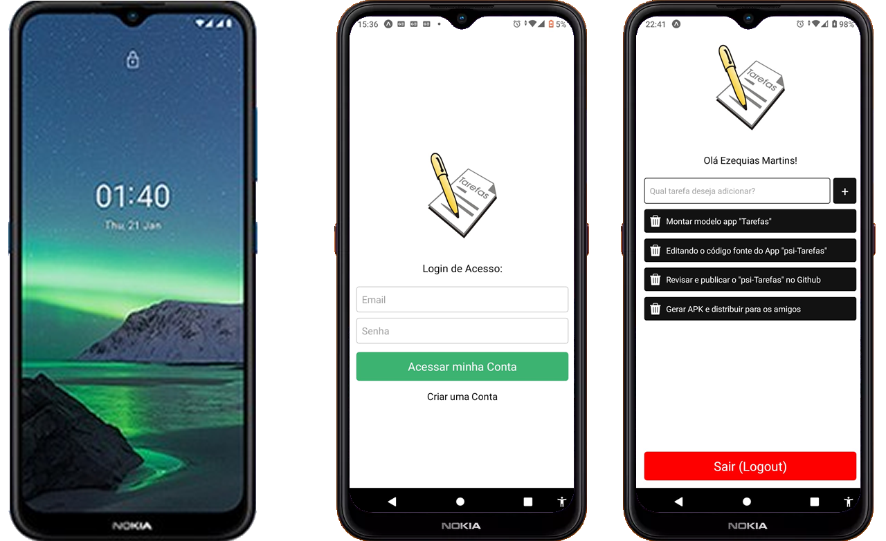

## psi-Tarefas (React Native)
App simples para Criar, Listar, Editar e Excluir Tarefas, baseado e adaptado do modelo meuApp "Tarefas", apresentado no curso "React Native - Criando aplicativos do zero ao avançado" c/ Matheus Fraga (Udemy)

## Contato

telefone: (31) 98410-7540 WhatsApp

email: ezequiasmartins@gmail.com

by <a href="https://ezequiasmartins.blogspot.com/" target="_blank">Ezequias Martins</a> ® 1999-2022 Direitos Reservados

